# Weekly classification progress and model structures

Week beginning 2026-09-07, recorded through **2026-09-09**. This is a snapshot
of this week's documented work, not a claim that the full week has elapsed.
It consolidates executed evidence without rerunning training or changing models.

## Current position

There is **no single validated best model** across the project. Stroke diagnosis
and clinician-observed gait impairment are different targets, with different
participants, thresholds and reference labels. Their AUROCs are not a common
leaderboard. A best seed is also not a separately validated deployable model.

| Track | Current reference | Position at this week's handoff |
|---|---|---|
| Executable stroke feature prototype | `stroke-phase-hr-v0.1.0` | Packaged logistic regression with ten input features. Stronger development results than its covariate/cadence baseline, but substantial neurological false positives remain. |
| Stroke CNN research | Actual Linn39 `gait_cnn` builder, multiple sensor contracts | Richer signals improved ranking over magnitude. No input arm passed every prespecified comparison. No universal winning input or promoted checkpoint. |
| Six-channel impairment CNN | `vga_screen_v1`, nine validation-selected fold/seed checkpoints | Earlier recipe has higher full-population AUROC than the latest fixed-duration runs. Still fails the screening criteria. Retained as a research reference, not promoted on test performance. |
| Latest completed optimization test | `vga_regularization_v1`, 27 checkpoints | Forty epochs, isolated weight decay and warm-up. No consistent false-alert reduction. No replacement model. |

## Work completed this week

| Workstream | Concrete result | Evidence |
|---|---|---|
| Stroke feature prototype and benchmark | Ten predictors reconstructed from 1,348 trials, all 259 participants retained. Twelve verification fits reproduced held-out results. Packaged API, serialization and input handling verified. | [Benchmark](BENCHMARK.md), [package](../../models/prototypes/stroke-phase-hr-v0.1.0/README.md) |
| ElderNet transfer | Frozen transfer, partial adaptation and feature fusion investigated. Pretrained fusion failed all four advancement comparisons. Its available population differs from the full stroke benchmark. | [Transfer](archive/2026-09/ELDERNET_TRANSFER.md), [lower-back result](archive/2026-09/ELDERNET_LOWER_BACK_RESULT.md), [partial adaptation](archive/2026-09/ELDERNET_PARTIAL_RESULT.md), [fusion](archive/2026-09/ELDERNET_FUSION_RESULT.md) |
| Gait-specific CNN implementation | Pinned upstream builder actually executed in 36 fits across four input contracts. Repaired class-dependent normalization and adapted participant-disjoint evaluation. | [Source review and results](archive/2026-09/GAIT_CNN_REVIEW.md) |
| DUO-GAIT evaluation | Reused existing raw files. Corrected foot/sacrum timestamp alignment after invalidating the first pass. Accepted 15,485 cycles across 16 people and four conditions. | [External evaluation](archive/2026-09/DUOGAIT_GAIT_CNN_RESULT.md) |
| Waveform frame and channel tests | Six-channel frame comparison completed. Then 36 new acceleration/gyro ablation fits and 27-model trial/cycle replay completed. Removing either channel group did not resolve specificity. | [Frame](archive/2026-09/GAIT_FRAME_RESULT.md), [ablation and localization](archive/2026-09/GAIT_CHANNEL_ABLATION_RESULT.md) |
| Impairment-screening target | Constructed actual first-session VGA labels: 84 normal, 164 impaired, 11 unknown. Eighteen fits and nine selected models. Corrected float32 calibration boundary, with zero held-out/external call changes. | [VGA baseline](VGA_SCREEN_RESULT.md) |
| Training-duration and regularization test | All 27 fits reached 40 epochs. Two small late validation recoveries, no epoch-40 best checkpoint. Weight decay/warm-up did not consistently reduce false alerts. | [Latest result and curves](VGA_REGULARIZATION_RESULT.md) |

These are separate, sometimes overlapping development comparisons. Do not sum
participants or interpret the experiments as independent cohort replications.

## Benchmark snapshot

### Stroke feature model

These are reproduced outer-fold results for the model family, **not** independent
validation of the all-data package or its single packaged threshold.

| Scope and model | AUROC | Stroke detected | Healthy false positives | Other-pathology false positives |
|---|---:|---:|---:|---:|
| Full covariate/cadence baseline | .798 | 44/49 | 12/72 | 61/138 |
| Full phase + HR candidate | **.897** | **45/49** | **6/72** | **56/138** |
| Matched baseline | .671 | 44/49 | 15/19 | 69/76 |
| Matched phase + HR candidate | **.835** | **44/49** | **5/19** | **47/76** |

The full candidate genuinely improves these development metrics over its baseline.
It has not solved neurological specificity: full positives include 13/19 CIPN,
13/24 PD and 30/51 RIL participants. The matched comparison fits separate models.
See [benchmark definitions and uncertainty](BENCHMARK.md).

### Stroke CNN input comparison

Original upstream-recipe adaptation, full 259-person population. Ranges span
three seeds. These experiments precede the waveform-frame and VGA changes.

| Input contract | AUROC | Stroke detected /49 | Healthy FP /72 | Neurological FP /94 |
|---|---:|---:|---:|---:|
| Lower-back magnitude, 1 channel | .637-.653 | 44 | 23-26 | 78-81 |
| Lower-back acceleration + gyro, 6 channels | .768-.798 | 44-47 | 14 | 66-77 |
| Bilateral feet acceleration + gyro, 12 channels | .799-.858 | 43-47 | 14-15 | 80-82 |
| Lower back + bilateral feet, 18 channels | .825-.837 | 47-48 | 10-19 | 67-82 |

More sensors improved ranking but did not consistently improve the calibrated
false-positive tradeoff. A bilateral-foot or 18-channel result cannot be offered
as a lower-back-only result. See [original comparison](archive/2026-09/GAIT_CNN_REVIEW.md).

### Current six-channel impairment screen

VGA 0 versus VGA 1-4, full 248-person population. The 84 normal-rated people include
19 diagnosed participants, so normal-rated false alerts differ from healthy-group
false alerts. Ranges span seeds, not confidence intervals.

| Training experiment | AUROC | Normal-rated false alerts /84 | Impairment detected /164 | Healthy VGA 0 false alerts /65 |
|---|---:|---:|---:|---:|
| Earlier validation-selected VGA recipes | .790-.797 | 14-18 | 88-105 | 6-9 |
| Latest cosine control | .769-.779 | 16-17 | 91-101 | 7-8 |
| Control + weight decay .01 | .769-.778 | 16-18 | 87-102 | 7-9 |
| Control + five-epoch warm-up | .778-.784 | 15-19 | 89-103 | 7-9 |

No row meets normal FPR <=10% and impairment sensitivity >=70% in every seed.
Warm-up improves paired full AUROC slightly, yet adds normal false alerts in two
seeds. Historical versus latest rows also change scheduling and recipe selection,
so they are not an isolated regularization contrast.

Generalization remains limited: the earlier VGA model's matched-subset AUROC is
.665-.701, with 12-14/28 normal alerts and 67-81/110 impaired detections. The latest
settings also remain weak there. DUO-GAIT supplies a reused external alert stress
test, not VGA ground truth or an independent impaired-positive cohort.

## Model structures and reproducible identities

### Current deep-learning structure

The earlier VGA reference and latest optimization runs use the same architecture:

```mermaid
flowchart LR
    A["Lower-back IMU: acc XYZ + gyro XYZ"] --> B["Reference-assisted straight strides"]
    B --> C["200 time points; waveform frame; fitting-only scaler"]
    C --> D["Conv1D: 32 filters, kernel 5, valid, ReLU"]
    D --> E["Global max pooling: 32 values"]
    E --> F["Dense: 2 outputs, softmax"]
    F --> G["Average cycles per trial, then trials per person"]
    G --> H["Calibration-only threshold; research alert"]
```



Input shape is `(batch, 200, 6)`, convolution output `(batch, 196, 32)`.
There are **1,058 trainable parameters**: 992 convolution parameters and 66 dense
parameters. No recurrent block, attention, residual stack or ElderNet fusion is
part of this model. It is trained from scratch using the actual pinned upstream
builder at commit `689cc9baa99e3fdd0be96c6f634280d34f752c17`.

The waveform frame is computed from mean acceleration and dominant horizontal
variation. It is not independently validated anatomical calibration. Stride
normalization removes absolute duration from the time axis. Reference-assisted
segmentation means this is not yet autonomous single-sensor streaming inference.

Earlier VGA training tests two recipes per fold/seed: Adam .02, maximum 25 epochs,
patience 3; or Adam .001, maximum 40 epochs, patience 8. Both reduce learning rate
on validation plateaus. Validation loss selects recipe/checkpoint separately in
each fold/seed; there is no one universally selected recipe. No decay, dropout,
warm-up, clipping or augmentation was used in that baseline.

The latest test uses Adam, batch 32, cosine .001 to .00001, all 40 epochs, best
validation checkpoint. Decay .01 and five-epoch warm-up are separate arms, not
a combined recipe. Best epochs span 1-24. Two simulated patience-eight stops
would miss loss improvements of .00533 and .00430. This does not establish that
the previous plateau schedule would have followed the same trajectories.

| Artifact | Where to find it |
|---|---|
| Earlier VGA models and fold scalers | `data/processed/vga_screen_v1/checkpoints/` |
| Exact earlier checkpoint/recipe choices | `data/processed/vga_screen_v1/selection.csv` |
| Latest 27 models and scalers | `data/processed/vga_regularization_v1/checkpoints/` |
| Latest choices, predictions and verification | `data/processed/vga_regularization_v1/` |
| Training implementation | [VGA runner](../../scripts/classification/benchmark_vga_screen.py), [regularization runner](../../scripts/classification/benchmark_vga_regularization.py) |
| Original stroke CNN artifacts | `data/processed/gait_cnn_v1/` |

The fold/seed models evaluate repeatability. They are not automatically an
ensemble: no averaged nine-model deployment benchmark was run here.

### Packaged stroke feature structure

This is **logistic regression, not deep learning**:

```text
10 participant features
  -> training median imputation + missingness indicator
  -> StandardScaler
  -> LogisticRegression(C=1, max_iter=3000)
  -> research score and threshold, or unknown for invalid input
```

Inputs: age, XSens fraction, protocol length, cadence, step asymmetry, swing
asymmetry, stance asymmetry, swing fraction, double-support fraction, and nominal-Y
log harmonic ratio. Fitting weights allocate total mass .50 to stroke, .25 to
healthy and .25 to other pathologies. Device/protocol/age are explicit covariates,
so its performance is not evidence of a sensor-only physiological signature.

Package: `models/prototypes/stroke-phase-hr-v0.1.0/model.joblib`, with manifest and
input contract in that directory. The full-data threshold is
`0.3953767333929809`, selected after inspecting development OOF scores. It has no
untouched evaluation. The benchmark table uses earlier nested fold thresholds,
not this packaged threshold. Only age may be missing at the public input API.

## Verification, limitations and handoff

The latest verification checks all 27 finite 40-epoch histories, exact schedules,
source hashes, label identity, fit/validation/calibration/test participant
separation, thresholds, exported calls, metrics and gate decisions. Three model
reload spot checks have maximum score error 5.93e-7 and zero changed calls. Two
tests verify the schedule and actual decoupled weight-decay behavior.

Remaining priorities are robust normal-rated specificity, mild-impairment
detection, independent positive-cohort evaluation, and sensor-only measurement
validation. Existing negative findings do not establish a unique biological
cause or prove all representations impossible. Do not restart completed phase,
transfer or optimization experiments from historical recommendations.

Metadata/label construction is documented and verified. Raw datasets were reused
for these comparisons. Preprocessing and the listed development evaluations are
complete. Independent clinical validation and autonomous deployment remain open.
No new model was promoted or training launched to prepare this weekly record.

## Published weekly page

[Week 3 GitHub Pages report](https://frankielingishere.github.io/imu_post-stroke-gait-classification/reports/WEEK_03_PROGRESS.html) is live. Previous Week 1 presentation and Week 2 benchmark/sprint reports were checked before building the page. The portal now links all three weeks, and labels Week 2 findings as historical. Desktop (1440 px) and mobile (390 px) checks passed: no page overflow, JavaScript errors, broken section links or missing images. The Pages workflow completed successfully at commit `9b5fc92`, and served HTML matches the local page.

Page source: `reports/WEEK_03_PROGRESS.html`. Builder: `scripts/classification/build_week3_page.py`. Deployment: `.github/workflows/publish-results.yml`. The self-contained page embeds the saved learning curves. This publication changes no model, data or benchmark result.

## Rewind: last week's proposed steps checked against execution (2026-09-09)

This follow-through check reads existing code, predictions and saved metrics. No
new fitting or publication occurred. The supplied augmentation synthesis is
historical and omits later native-window and GAITEX follow-through.

| Proposed step | Verified status |
|---|---|
| Distinguish pooled .965 from source-held-out .8882 | Correct distinction. They change protocol and input/model recipe; the difference cannot be attributed to missing feet. |
| Five-seed source-held-out one-/three-channel comparison | Executed for seeds42/137/202/314/515. Both ERM prediction tables contain the same1,570 participant/seed/label rows, covering314 people. Saved configs match except representation. |
| Separate matched ERM from ensemble results | Both ERM controls and identical ensemble recipes already have saved results. The summary below now makes this explicit. |
| Exactly matched training duration for a sensor-only contrast | Not complete. Validation selected ERM epochs12/8/4 for lower back versus16/12/12 for three channels (Felius/Sint/Voisard holdouts). Same tuning policy is not identical duration. |
| Review variation and conditionally extend to10/20 seeds | Original runs contain five seeds. This check computed source-specific ranges. No extension is established by these artifacts. No numerical trigger for 'substantial' variability was locked in the supplied proposal. |
| Physics-grounded virtual IMU work | Substantial follow-through completed using GAITEX, but explicit L5 placement remains unresolved. Pelvis-proxy simulation, distribution audit, affine adaptation and SSL transfer were executed and not adopted. |
| Independent compatible clinical cohort | Not resolved by more seeds, same-source pathology holdouts or the later VGA experiments. |

### Existing source-held-out comparisons, without new training

Arithmetic means across15 source/seed units, not pooled participant metrics.

| Matched recipe | Lower-back AUROC / BA | Three-channel AUROC / BA |
|---|---:|---:|
| ERM | .8737 / .7834 | .8973 / .7959 |
| ERM + CORAL + ERM++-style | .8882 / .8140 | .9021 / .7997 |
| ERM + ERM++-style | .8793 / .8128 | .9025 / .8055 |

The published .8882 and .9025 select different ensemble recipes. The identical
recipe rows remove that ensemble mismatch, but representation-specific epoch
selection remains. A fixed-duration ERM contrast would narrow the sensor question.
Even that would not isolate the effect of pooled versus source-held-out validation:
that requires the same architecture/input/training contract under both split schemes.
Do not interpret these tables as a causal decomposition of the earlier .965 drop.

Seed variation is consequential at the operating point. Lower-back ERM Voisard
FP spans10-47, balanced accuracy .6736-.8615; three-channel ERM Voisard FP13-40.
Lower-back ERM Sint AUROC spans .780-.915. The selected lower-back ensemble is
steadier, but its Voisard FP still spans11-24. Five seeds cannot be declared
universally sufficient from these results. Additional seeds would assess optimizer
variation, not create additional independent clinical cohorts. The original
15-unit bootstrap treats source/seed units as resample units; those share sources
and participants, so its intervals are not independent-cohort uncertainty.

Sources: `evidence_gated_lower_back_dg_*` and `evidence_gated_three_channel_dg_*`
under `data/processed/`, and `src/models/evidence_gated_domain_generalization.py`.
Read-only summaries are saved in `data/processed/last_week_followthrough_review/`.

### Corrections to the supplied synthesis chronology

The historical mixing, recombination, VAE, diffusion and physical augmentation
methods have implementation records. But 'synthetic windows were never used for
classifier training' is too broad: later native500x3 diffusion generated600
windows per source and tested0/5/10/20% enrichment. The0% and5% arms were then
repeated at seeds42/43/44. AUROC was .9777 versus .9731, Brier .0712 versus .0715,
and BA .9076 versus .9082. The repeated utility gate failed, so another RevalExo
ratio test was deliberately not run. These are failed experimental training arms,
not synthetic data in the retained final classifier. See
[native-window follow-through](../../reports/NATIVE_HEALTHY_WINDOW_SYNTHESIS_2026-09-01.md).

Physics-based work is not merely a future suggestion. GAITEX produced293 virtual
windows from18 people using pelvis_proxy_not_l5 and bilateral feet. A20-split
affine-adapter test still yielded median source-discrimination AUROC .999.
Architecture-matched SSL transfer yielded AUROC .9632 versus scratch .9646,
Brier .0753 versus .0733 and BA .8987 versus .9043. It was not adopted. Saved
artifacts exist under `data/interim/gaitex_2026/`; the
[GAITEX wiki record](../../wiki/datasets/gaitex-2026.md) documents the completed
work. This is not a completed anatomically validated L5 simulation, and does not
establish completion of every proposed realism/privacy/TSTR/TRTS check.

The fixed-duration sensor contrast and its seed stability remain secondary
measurement questions. The supervisor-aligned grant objective below takes priority. Do not restart the completed synthesis/GAITEX route from
its historical 'next step' wording. Any new experiment should be separately locked;
this review did not authorize or launch a training sweep.

## Supervisor feedback: grant alignment and next deliverables

Recorded 2026-09-09 from the supervisor feedback supplied by the user. This is
an updated work plan and interview draft, not an executed stroke generator,
validated clinical parameter set or completed consultation. The prior-week
follow-through above is part of this week's progress review.

### Objective and honest accounting

**Primary grant objective: generate synthetic stroke-like gait from healthy
sources using clinically grounded parameters.** Classification is a downstream
utility check, not a substitute for this objective. The separate VGA screening
track also does not fulfill it.

MAREA/DUO-GAIT generators learned healthy-source distributions. They generated
synthetic healthy gait, not clinically controlled stroke gait. Those experiments
can be described as exploratory pipeline groundwork. The records do not establish
that a validated two-stage healthy-to-stroke transformation had already been
implemented, or that this was a documented original staged plan. A clinical
stroke transformation and its validation remain outstanding.

The observed smoothing, variance loss and spectral deficits demonstrate failures
of the tested recipes on the available data. Small training samples are a
plausible contributor, alongside model capacity, objective, normalization and
sampling. No data-size ablation isolated their contributions. Do not present
these outcomes as proof that VAE/diffusion methods are unsuitable in general.

GAITEX already supplied physics-derived healthy pelvis/foot signals and a failed
transfer experiment. It did not supply clinically parameterized stroke motion or
a validated L5 attachment. Reuse the completed acquisition, geometry and adapter
evidence; do not repeat the old healthy-only experiment as new grant progress.

### Evaluation restriction, effective now

- RevalExo is historical evidence only. Do not use it for new method selection,
  threshold setting, rejection, acceptance, early stopping or parameter tuning.
  Preserve the prior results and disclose their repeated inspection. Failure-driven
  changes are also information use; exclusion from gradient fitting is insufficient.
- Use Felius/Voisard/Sint development data for comparisons. Before a new experiment,
  lock participant groups, permitted fitting/calibration roles, comparison metrics
  and seed policy. Keep all visits/windows of a participant together. Fit clinical
  parameter mappings and sensor adaptations only within the permitted training data.
- A newly reserved subset of already inspected data is a prospective development
  holdout from now onward, not retroactively pristine external evidence. Once its
  results guide a change, record that exposure and retain its development status.
- A clean final cohort has not yet been secured. Its compatibility may be checked
  before locking the model, but keep outcome-dependent inspection and test labels
  unavailable to method development. Freeze the simulator, adapter, classifier,
  thresholds and exclusions before final evaluation. Any post-test change needs
  fresh independent evaluation.
- More seeds improve information about optimization variability, not cohort
  independence. The existing same-method LOSO comparisons are useful but still
  differ in selected durations. Neither .9025 versus .8882 nor the ERM table
  causally attributes the earlier pooled-versus-LOSO difference to sensor removal.

### Three concrete next deliverables

1. **Clinical parameter specification.** Combine an unsent Ms. Chua interview
   guide with primary clinical/biomechanical evidence. For each candidate variable,
   record its definition, units, side/sign convention, measurement method, applicable
   population/protocol, plausible bounds, joint constraints, uncertainty and source.
   Separate elicited expert ranges from published measurements and modeling choices.
   Do not invent numerical severity ranges or fit them to RevalExo performance.
2. **One bounded healthy-to-stroke-like physics pilot.** Select a parameterized
   impairment pattern supported by that specification. Modify underlying motion
   with coupled, feasible timing/kinematics, then derive virtual sensor readings
   at an explicit attachment. Do not label generic noise, reduced speed or arbitrary
   amplitude scaling as stroke. GAITEX pelvis_proxy_not_l5 must stay a pelvis proxy
   until an explicit lower-back attachment and measurement validation exist.
   Record each generated sample's healthy parent, parameter vector, simulator version
   and intended impairment phenotype; do not count it as a new clinical participant.
3. **Locked validation of that pilot.** Test parameter recovery and physical/temporal
   consistency first, then compare real held-out development stroke and non-stroke
   gait under compatible measurements. Distinguish realism, stroke specificity and
   downstream classifier utility. Compare real-only against real-plus-synthetic using
   fixed development splits and controls. Keep synthetic descendants of a healthy
   parent out of evaluation folds containing that parent. Passing a clinician review
   or increasing classifier positives alone does not validate synthetic stroke gait.

Candidate parameters below are questions for evidence gathering, not accepted
stroke markers. Severity may require multivariable profiles rather than one
universal mild/moderate/severe numerical ladder. Within-session variability and
between-day variability need separate treatment. Cross-sectional severity must
not be presented as validated longitudinal recovery.

### Supervisor expectations: completion assessment

**Not all expectations are fulfilled.** The revised reporting and work plan address
the feedback, but they do not count as implementation of the grant deliverable.
This is our assessment against the supplied feedback, not supervisor sign-off.

| Expectation | Status | Evidence or remaining gap |
|---|---|---|
| Explain what was generated | Addressed in reporting | MAREA/DUO-GAIT outputs were healthy gait. A deliberate original two-stage stroke plan is not established by the records. |
| Generate clinically controlled stroke-like gait | Outstanding | No implemented and validated healthy-to-stroke transformation or accepted clinical parameter specification yet. |
| Interpret generator failures cautiously | Addressed in reporting; cause untested | Small-data effects are plausible. No controlled data-size experiment proves the cause or rules out whole generator families. |
| Pursue physics-grounded synthesis | Partial | GAITEX healthy virtual signals, adaptation and SSL were tested. Clinical stroke transformation and a validated L5 attachment remain open. |
| Retire RevalExo from new decisions | Policy recorded | Historical-only restriction is explicit. Past inspection cannot be undone; this is not a new independent validation result. |
| Lock a development holdout and preserve a clean final cohort | Partial: engineering roles locked | GAITEX pilot has 14 available build and 4 holdout parents, assigned before generation. Previously inspected data remain development-only. Clinical synthesis outcome roles and a clean final cohort remain outstanding. |
| Separate validation, sensors and ensemble effects | Partial | Same-method ERM/ensemble results are now reported. Fixed-duration sensor comparison remains unexecuted; the original AUROC drop is not causally decomposed. |
| Obtain clinical input from Ms. Chua | Guide prepared; responses unverified | Eight existing questions plus four additions cover recovery, trunk measurements, differential gait and quantitative ranges. No consultation or clinical answers are claimed. |
| Model recovery over time | Outstanding | Recovery questions are included. No longitudinal clinical parameter trajectory or recovery validation has been implemented. |

Next substantive evidence: a sourced clinical parameter specification, one bounded
stroke-like physics pilot, and a locked development evaluation. Ms. Chua's answers
and independent final-cohort access are not assumed to exist. The fixed-duration
sensor comparison supports that work but does not replace it. No new experiment
was run to create this checklist. The revised web page is local, pending approval.

### Ms. Chua interview guide: existing questions and targeted additions

The user supplied the existing guide below. Preserve these questions rather than
replacing them with a second overlapping interview. Delivery/response status of
the user's guide has not been verified. No outreach was sent by the assistant.

**Opening:** In your clinical experience, how do you distinguish slow or cautious
walking in an older adult from walking impairment caused by stroke?

1. Which gait characteristics can occur in both healthy ageing and stroke, and which combinations would make you more suspicious of stroke-related impairment?
2. How do fatigue, pain, weakness, poor balance, fear of falling, or walking aids change the way a person walks?
3. Which gait characteristics would you consider most important when assessing someone with possible stroke-related walking impairment?
4. Which of those characteristics can be meaningfully assessed from a short walking test rather than a longer clinical assessment?
5. Could you explain what FAC levels 1 to 5 look like in practice, and what FAC does or does not tell you about gait quality?
6. Can two people with the same FAC score have clinically different gait patterns? What differences would FAC fail to capture?
7. Besides FAC, which patient information or clinical observations would you need before interpreting someone's walking pattern as stroke-related rather than simply slow, cautious, or age-related?
8. If we later wanted to simulate clinically meaningful gait patterns, which combinations of gait characteristics would represent realistic patient types, and which combinations would be clinically unrealistic?

**Four additions from the supervisor feedback:**

9. Over repeated assessments across weeks, what tells you a patient is truly improving rather than having a good day? Which changes tend to appear first or last, and how would you distinguish recovery from compensation or changes in assistance?
10. What trunk movements or compensations do you observe after stroke? Which might be meaningfully measured at the lower back, and which would require observations or sensors elsewhere?
11. Compared with Parkinson's, MS or post-fracture walking, which combinations make you more suspicious of stroke-related impairment? Which patterns overlap too much to distinguish from gait alone?
12. For the realistic patient types in question 8, can you suggest approximate walking-speed and asymmetry ranges, or measurements/references we should consult? Under what walking task, assistance and clinical classification do those ranges apply, and which parameter combinations would be unrealistic?

**Optional probes, not another mandatory question list:** For question 12,
distinguish step length, step time, stance time and swing time; ask which definition
and units the clinician uses rather than imposing an unexplained asymmetry formula.
Request coupled patterns, variability and exceptions rather than independent
min/max values. If numeric estimates are uncertain, record that uncertainty and
ask for a measurement or reference instead. Do not equate FAC with a complete
simulation parameter profile without the qualifications elicited in questions 5-7.
For question 8, ask which single pattern to simulate first and whether the clinician
could later review examples for plausibility. Expert review supports the parameter
specification but does not by itself validate clinical diagnostic performance.

This consolidates the existing questions with the supervisor's missing topics:
longitudinal recovery, trunk/lower-back observability, differential conditions and
quantitative simulation inputs. No clinical answers or ranges have been assumed.
The local Week 3 page contains this updated guide; publication remains pending
user review. No training, consultation, staging, commit or push occurred.

## Executed progress: synthesis parameter contract v0.1

2026-09-09. [Parameter specification](STROKE_SYNTHESIS_PARAMETER_SPEC.md) now
records a checked primary clinical source, explicit side/units/task conventions,
individual illustrative observations and unresolved clinical bounds. These are
not a universal severity distribution or a completed clinician consultation.

Implemented `src/data/stroke_synthesis_contract.py`: derive a consistent steady
alternating cycle from speed, cadence, step-length ratio, opposite-contact phase
and bilateral stance fractions. Step lengths, step/swing times and both support
overlaps are coupled rather than sampled independently. Five unit tests passed,
covering symmetric closure, both asymmetry directions, periodic contact overlap,
flight gaps and invalid inputs. Fixtures are engineering examples, not patients.

This completes an initial parameter definition and algebraic constraint layer.
It does not generate motion or IMU signals, validate a clinical phenotype, secure
an L5 attachment, lock a new development split or validate a recovery trajectory.
No RevalExo data, training or classifier evaluation was used. The next gap is a
motion representation and evidence-backed joint bounds, not another healthy-only
classifier experiment. Local weekly page and wiki updated; final review precedes
any push.


## Executed progress: six-channel virtual IMU pilot

Implemented the rigid-attachment sensor calculation and ran it on 18 existing
healthy GAITEX parents: **55 windows, each 500 samples x 6 channels**. Nineteen
parent directories were inventoried; hans lacks required source files and remains
explicit in coverage. This is a bounded first-window-per-segment pilot, not full
cohort clinical benchmarking. No downloads or model training occurred.

Six physics tests pass (eleven including the earlier cycle tests). Output shape,
finite values, index mapping and parent-role consistency checks also pass.
Development roles were recorded before generation: 14 available build parents
and 4 holdout parents, all previously inspected development data. Output is a
pelvis marker-frame virtual sensor, not L5 or hardware-axis calibrated signals.

[Full implementation, results and limits](STROKE_SYNTHESIS_PARAMETER_SPEC.md#executed-rigid-attachment-imu-pilot-2026-09-09).
This advances the sensor component of the grant pipeline; it does not yet produce
stroke-like gait. The remaining clinical bounds, motion transformation, L5
attachment, phenotype/measurement validation and final cohort are explicitly open.
Existing classifier performance and false positives are unchanged. RevalExo was
not used. Wiki and local Week 3 page updated; no staging, commit or push.


## Publication scope (2026-09-09)

User authorized publication of completed work only. Commit `b462795` pushes only
`reports/WEEK_03_PROGRESS.html` and its builder. Public content includes executed
benchmarks, generation/transfer results and the completed sensor pilot, with result
limitations. Plans, interview questions, unfinished deliverables and all other
pending code/documentation remain local. This Markdown is the internal working
record, not the published page. Desktop/mobile layout, anchors and Git whitespace
checks passed. No raw data, model weights, new prototype code or PDF deletion was
included in the commit.

Pages deployment and repository hygiene succeeded; the live completed-results page was verified after publication.


## Workspace cleanup (2026-09-09)

Ten completed reviews/results moved to `docs/classification/archive/2026-09/`;
relative links updated. Active-folder file count reduced from 25 to 15. Replaced
copied status paragraphs with short navigation and a single current handoff.
Corrected three stale wiki summaries that still described TVS acquisition/pilot
work as pending. Locked protocols and reproducibility runners were retained at
existing paths; no experimental results, raw data, weights or source code deleted.
Uncommitted work includes completed experiments, not only unfinished tasks.
Cleanup remains local pending review. No training or numerical result changed.


## [2026-09-09] Notebook migration: virtual-IMU experiment

User confirmed experiment notebooks with stored outputs, keeping reusable Python
modules/tests. Notebook 35 now holds orchestration and an executed read-only
artifact replay: cohort/exclusion tables, hashes, consistency checks and embedded
six-channel plot. Removed the duplicated pilot runner. Configured the existing
CUDA venv as the gait-cu130 Jupyter kernel. No generation or training rerun;
metadata/raw/preprocessing and clinical outcomes unchanged. Other historical
runners remain pending migration. Local changes only, nothing pushed.


## [2026-09-10] Local Git checkpoint by purpose

User requested an empty staged/unstaged inventory. Preserved pending changes on
local review branch work/classification-local-2026-09-10, grouped into code/tests,
completed evidence, internal research documents, notebook/wiki records and page
maintenance. The pre-existing PDF deletion is recorded separately and recoverable
from Git history. Generated outputs and downloaded dependencies remain ignored.
No push: published main remains b462795. Clean Git status is housekeeping, not
completion of the clinical synthesis objective or remaining notebook migration.
107 Python files parsed, two notebooks loaded, eleven targeted synthesis tests
passed and whitespace checks passed. This is not a rerun of all experiments.
Metadata/raw acquisition, preprocessing and clinical evaluation are unchanged.


## [2026-09-10] Reporting scripts consolidated into saved-output notebooks

Replaced five phase/measurement summarizers with notebook 36 and the VGA
regularization report writer with notebook 37. Saved outputs include full selected
CSV tables, JSON decisions/verification, source artifact hashes and the existing
learning-curve image. Reporting cells were executed read-only; original code is
retained in disabled audit cells and recoverable at its recorded Git revision.
All six original source-byte hashes verified; no Python import dependencies on
the removed modules were found. Shared training helpers and utilities remain
Python pending dependency-preserving migration. Notebook guide, script guide,
workspace guide, wiki and local page updated. Metadata/raw acquisition,
preprocessing, model predictions and clinical evaluation unchanged. No push.


## [2026-09-10] Complete script structural inventory

Notebook 38 records all 139 scripts, importing consumers, exact notebook-path
mentions, literal artifact paths and source hashes. Parsed 216 tracked Python
files without syntax errors and scanned 54 existing notebooks including archives.
Triage: 27 shared-dependency scripts, 20 utility candidates, 92 notebook-migration
candidates. Eight missing-path flags: six scripts have archive counterparts and
two Mobilise-D scripts do not have the checked data paths. No exact duplicate
scripts. These are structural checks, not a full semantic review, saved-output
coverage proof or permission to delete. No code removal, training or download.
Metadata/raw acquisition, preprocessing and evaluation unchanged. Reading guides,
wiki and local progress page updated; no push.
