# Notebook guide

Current through 4 September 2026: 34 active numbered notebooks and 18 Week 2
experiments are represented in the public sprint presentation. The three
candidate external datasets identified in that presentation are listed in the
[dataset access guide](../reports/DATASET_ACCESS_GUIDE.html).

Start with [00_READ_THIS_FIRST.md](00_READ_THIS_FIRST.md). The 34 numbered
notebooks are an auditable research record, not a 34-step onboarding tutorial.
Only five are required for a first reading: **01, 02, 29, 30, and 34**.

## Reader map

```mermaid
flowchart LR
    A[01–05<br/>Data contract] --> B[06–10<br/>Initial models]
    B --> C[11–13<br/>Frozen external audit]
    C --> D[14–24<br/>Enrichment and sampling]
    D --> E[25–28<br/>Lower-back transport]
    E --> F[29<br/>Selected development model]
    F --> G[30<br/>FP/FN and test credibility]
    G --> H[31–33<br/>Rescue tests and method audit]
    H --> I[34<br/>Canonical corrective benchmark]
    I --> J[Model rotation closed<br/>Untouched paired evaluation next]
```

The arrows show the evidence dependency, not a requirement to read every file.
Use the phase summaries below to enter only where your question begins.

## Phase 1 — Data understanding and reproducible inputs

| No. | Notebook | What it contains | Current role |
|---:|---|---|---|
| 01 | [Post-stroke gait baseline](01_post_stroke_gait_baseline.ipynb) | Cross-dataset EDA and observed gait-pattern differences | Essential context |
| 02 | [ML-readiness audit](02_ml_readiness_audit.ipynb) | Participant, trial, label, and leakage audit | Essential contract |
| 03 | [Signal preprocessing and windows](03_signal_preprocessing_and_windows.ipynb) | Common preprocessing and 500-sample window construction | Reproduction |
| 04 | [Felius walking validation](04_felius_walking_activity_validation.ipynb) | Checks which Felius activities are valid walking | Dataset QA |
| 05 | [Materialize validated windows](05_materialize_validated_windows.ipynb) | Produces the validated modelling tensors and manifests | Reproduction |

## Phase 2 — Initial baseline and covariate questions

| No. | Notebook | What it contains | Current role |
|---:|---|---|---|
| 06 | [Fold normalization and baseline](06_fold_normalization_and_baseline.ipynb) | Training-fold-only normalization and classical baseline | Baseline evidence |
| 07 | [Cross-dataset CNN](07_cross_dataset_cnn.ipynb) | Initial cross-source deep model | Historical comparator |
| 08 | [Robust pooled training](08_robust_pooled_training.ipynb) | Source balancing and harmonization tests | Method development |
| 09 | [Repeated validation and calibration](09_repeated_pooled_validation_calibration.ipynb) | Repeated pooled estimates and calibration | Method development |
| 10 | [Age-classifier feasibility](10_age_classifier_feasibility.ipynb) | Tests whether age can support a separate staged model | Feasibility evidence |

## Phase 3 — Frozen external evaluation

| No. | Notebook | What it contains | Current role |
|---:|---|---|---|
| 11 | [RevalExo external pipeline](11_revalexo_external_validation_pipeline.ipynb) | Frozen cohort adapter and gravity-inclusive signal contract | External-data QA |
| 12 | [Frozen RevalExo evaluation](12_frozen_external_revalexo_evaluation.ipynb) | One-time locked external performance | External evidence |
| 13 | [External error and shift analysis](13_revalexo_external_error_and_shift_analysis.ipynb) | Error cases and distribution-shift diagnosis | Limitation analysis |

## Phase 4 — Healthy enrichment and sampler investigations

These notebooks document why apparently useful healthy-only data were not
blindly pooled. They are decision evidence, not recommended starting points.

| No. | Notebook | What it contains | Current role |
|---:|---|---|---|
| 14 | [NONAN candidate materialization](14_nonan_candidate_healthy_materialization.ipynb) | Creates candidate healthy windows | Candidate preparation |
| 15 | [NONAN compatibility gate](15_nonan_source_compatibility_gate.ipynb) | Representation and source compatibility checks | Admission gate |
| 16 | [Bounded NONAN enrichment](16_bounded_nonan_enrichment_ablation.ipynb) | Controlled enrichment ratios | Negative result |
| 17 | [Repeated NONAN gate](17_repeated_paired_nonan_enrichment_gate.ipynb) | Repeated-seed enrichment decision | Negative result |
| 18 | [Class-aware alignment pilot](18_class_aware_nonan_alignment_pilot.ipynb) | Class-conditional alignment attempt | Negative result |
| 19 | [Felius segmentation audit](19_felius_source_faithful_segmentation_audit.ipynb) | Source-faithful segmentation check | Data QA |
| 20 | [Participant-balanced pooling](20_participant_balanced_nonan_pooling_pilot.ipynb) | Corrects participant contribution imbalance | Candidate method |
| 21 | [Repeated participant-balanced gate](21_repeated_participant_balanced_nonan_gate.ipynb) | Repeated decision for participant-balanced pooling | Negative result |
| 22 | [Legacy sampler correction](22_legacy_sampler_correction_benchmark.ipynb) | Audits and corrects the earlier sampler | Corrective evidence |
| 23 | [Sampler leave-one-source-out](23_sampler_leave_one_source_out_benchmark.ipynb) | Tests sampler transport across sources | Robustness evidence |
| 24 | [Tempered sampler LOSO](24_tempered_sampler_leave_one_source_out.ipynb) | Bounded alternative sampling strength | Negative result |

## Phase 5 — Lower-back representation and source expansion

| No. | Notebook | What it contains | Current role |
|---:|---|---|---|
| 25 | [Lower-back accel+gyro transport](25_lower_back_accel_gyro_source_transport_pilot.ipynb) | Tests a 6-DoF lower-back representation | Representation audit |
| 26 | [Sint 6-DoF adapter audit](26_sint_6dof_lower_back_adapter_audit.ipynb) | Verifies Sint channel mapping and units | Dataset QA |
| 27 | [Materialize Sint 6-DoF](27_materialize_sint_lower_back_accel_gyro.ipynb) | Produces verified Sint tensors | Reproduction |
| 28 | [Three-source lower-back 6-DoF benchmark](28_lower_back_6dof_three_source_transport_benchmark.ipynb) | Compares expanded lower-back representation across sources | Model evidence |

## Phase 6 — Current model decision and unresolved errors

| No. | Notebook | What it contains | Current role |
|---:|---|---|---|
| 29 | [Evidence-gated source-only DG](29_evidence_gated_source_only_domain_generalization.ipynb) | Five-seed source-held-out comparison and selected lower-back ensemble | **Current model decision** |
| 30 | [FP/FN and test credibility](30_fp_fn_and_test_set_credibility_audit.ipynb) | Participant-level confusion counts, uncertainty, and final-test requirements | **Current limitation** |
| 31 | [Score overlap and heterogeneous rescue](31_score_overlap_and_heterogeneous_rescue.ipynb) | Threshold frontier and reduced-MiniROCKET fusion | Rejected rescue |
| 32 | [Participant-level attention MIL](32_participant_level_attention_mil.ipynb) | Mean and gated-attention participant pooling | Rejected rescue |
| 33 | [Prior-method code alignment](33_prior_method_code_alignment_audit.ipynb) | Exact comparison with official implementations; narrows what prior failures prove | Corrective authority |
| 34 | [Canonical corrective benchmark](34_canonical_inceptiontime_minirocket_corrective_benchmark.ipynb) | Five-seed InceptionTime, 10k MiniROCKET, fixed fusions, and strict FP/FN gate | **Final model decision** |

## What happens next

Notebook 34 completed the only authorized corrective benchmark. Neither model
nor any fixed fusion reduced both FP and FN while preserving performance across
all held-out sources. The notebook-29 ensemble therefore remains frozen and
architecture rotation on these participants is closed. Do not create notebook
35 for another model variant. The next evidence notebook should exist only
when a genuinely untouched paired cohort is ready for locked evaluation.

## Execution and archive status

- Audited through **2026-09-03**: all 34 active notebooks are executed and have
  no saved error outputs.
- Import-only and function-definition cells may intentionally show no output.
- The 17 notebooks under `archive/` are executed historical explorations and
  are not part of the current workflow.
- Keep active numbering continuous. The next number is 35, but reserve it for a
  genuinely new evidence stage rather than another architecture variation.
- Material findings belong in an executed notebook. Reusable scripts may
  support the work but do not replace notebook evidence.
