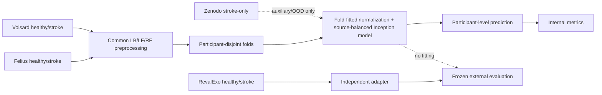

# Baseline data flow

```mermaid
flowchart LR
    A[Felius healthy/stroke] --> C[Common LB/LF/RF preprocessing]
    B[Voisard healthy/stroke] --> C
    C --> D[Participant-disjoint folds]
    D --> E[Fold-fitted normalization + source-balanced Inception model]
    E --> F[Participant-level prediction]
    F --> G[Internal metrics]
    H[RevalExo healthy/stroke] --> I[Independent adapter]
    I --> J[Frozen external evaluation]
    E -. no fitting .-> J
    K[Zenodo stroke-only] -. auxiliary/OOD only .-> E
```
